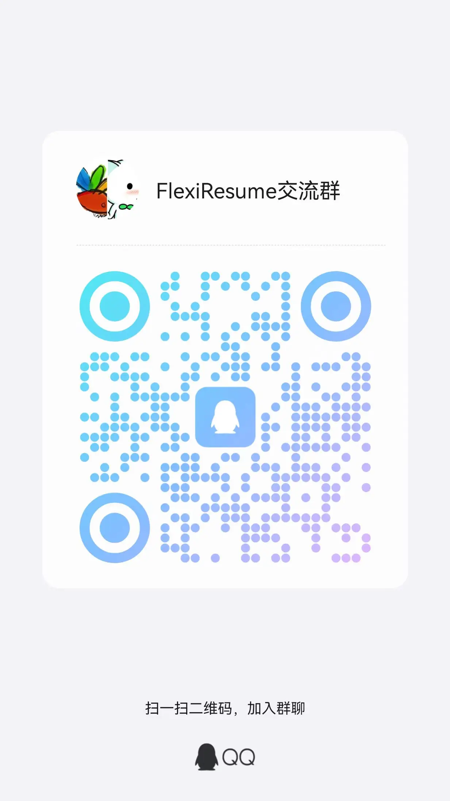

<p align="center">

</p>
<p align="center" style="font-size:5rem">
FlexiResume
</p>


**项目起源：**

> 在找工作时，我发现即使对于一些*1-3年经验的职位*，我的简历仍被多次标记为“不合适”或“经验有差异”。
我开始思考其中的原因，探讨了年龄、学历、薪资要求等多种可能性。
虽然我的经验和能力完全能够满足岗位需求，薪资也符合岗位要求范围时，但简历却似乎未能准确传达我的核心竞争力。

> 这种情况让我意识到，**简历需要根据职位的具体需求进行个性化调整**，让招聘方能快速找到他们需要的信息。
出于这一需求，我设计了这个开源项目，目标是为自己和他人提供一种**高度自定义、可扩展的简历生成工具**。


**项目概述**  
> 开发了一款高度自定义的简历生成器，支持多职位申请，用户可以灵活配置简历内容和格式，满足不同职业的需求。

**核心功能**  
- **高度自定义**：用户可以根据个人需求自由定制简历的各个部分，确保简历能够突出个人特色与优势，为简历添加更多深度信息。
- **Markdown支持**：支持使用Markdown语言编写简历内容，简化文本格式化过程，提升用户体验。
- **二维码动态生成支持**：如果配置`Data.ts.header_info.qrcode`了固定的URL，那默认会生成固定URL的二维码，如果设置值位`true`则会根据当前URL地址生成。
- **技能高亮**：根据用户设定的熟练度高亮显示技能，帮助招聘方快速识别重点能力。
- **模块化配置**：简历数据模块化配置，支持根据不同职位设置不同参数和模块数量（如期望薪资、工作经历板块数量等）。
- **响应式设计**：确保简历在不同设备上均能良好展示，适应多种屏幕尺寸。
- **折叠功能**：允许提前设置模块或树结构中的节点是否折叠。
- **作品外链与时间线**：提供作品外链功能，并允许嵌套时间线描述技能或成长路径，展示用户的职业发展历程。

技术栈采用 **Vite+React+SWC+TypeScript+Mobx+framer-motion+remark-html**，项目无第三方 UI 框架嵌入，以便最大程度上支持用户的个性化调整需求。通过这一项目，我希望不仅能优化自己的求职体验，也能帮助更多人找到更合适的机会。
提供了一个灵活、高效的简历生成工具，帮助用户在求职中脱颖而出，获得积极反馈。

## 安装使用

> git clone https://github.com/dedenLabs/FlexiResume.git
> 
> cd FlexiResume
> 
> npm install

## 在线DEMO
> [https://demo.deden.cn:8080/](https://demo.deden.cn:8080/)
## 调试
> npm run dev

## 编译
> npm run build


## 模块类型
``` js
header_info                   // 简历头部模块
base                          // 基础类型模块
timeline                      // 时间线模块
personal_strengths            // 个人优势模块
skills                        // 技能模块
skill_level                   // 技能 练度,高亮
employment_history            // 工作经历模块
project_experience            // 项目经历模块
```
 
## 简历页签-自定义模块扩展
> src\pages\FlexiResume.tsx
> 扩展模块 --- 这里添加新模块
``` js
switch (m.type) {
    case 'header_info'://个人信息模块
    case 'skill_level'://技能熟练读模块
    case undefined:
        return null;

    case 'skills'://技能树
        return (
        <Section key={i} title={m.name} {...args}>
            <TimelineCard id={key} {...args} />
        </Section>
        );
    case 'employment_history'://工作经历
    case 'project_experience'://项目经验
        return (
        <Section key={i} title={`${m.name}${m?.list?.length > 1 ? "（" + m?.list?.length + "）" : ""}`} {...args}>
            <EmploymentHistoryCard id={key} {...args} />
        </Section>
        );
    case 'education_history'://教育经历
        return (
        <Section key={i} title={`${m.name}${m?.list?.length > 1 ? "（" + m?.list?.length + "）" : ""}`} {...args}>
            <EducationHistoryCard id={key} {...args} />
        </Section>
        );
    case 'personal_strengths'://个人优势
        return (
        <Section key={i} title={m.name} {...args}>
            <PersonalStrengthCard id={key} {...args} />
        </Section>
        );
    case 'timeline'://时间线模块
        return (
        <Section key={i} title={m.name} {...args}>
            <TimelineCard id={key} {...args} />
        </Section>
        );
////////////////////////这里增加新模块//////////////////////
    case 'xxx':
        return (
        <Section key={i} title={m.name} {...args}>
            <xxxxCard id={key} {...args} />
        </Section>
        );
////////////////////////这里增加新模块//////////////////////
    default:// 默认基础模块
        return (
        <Section key={i} title={m.name} {...args}>
            <BaseCard id={key} {...args} />
        </Section>
        );
}
```


## 修改简历数据
> src\data\Data.ts 
``` js
│  Data.ts                                    简历数据入口 
│                                             共享基础数据配置这里,其他配置也是往这里赋值追加数据.
│                                             特殊字段`expected_positions`,它是用来配置多岗位的,它内部结构和Data.ts一致,用来合并岗位数据到Data.ts中.
│                                               
├─module                                      模块数据
│      DataContractTaskProjects.ts                          
│      DataEducationHistory.ts                              
│      DataEmploymentHistory.ts                             
│      DataGameProjects.ts                                  
│      DataOpenSourceProjects.ts                            
│      DataPersonalInfluence.ts                             
│      DataPersonalProjects.ts                              
│      DataProjectExperience.ts                             
│      DataSkills.ts                                        
│                                               
└─positon                                     岗位简历排版
        DataContractTask.ts                              
        DataFrontendBackendCTO.ts                        
        DataGameDev.ts                                   
```          

## QRCode 配置
``` js
默认居左:!QRCode:https://example.com size=100 
居中:<p align="center"> !QRCode:https://example.com size=100 </p>
```

## nginx.conf 配置注意事项
> ./nginx.conf
> try_files $uri $uri/ /index.html; # 对于单页应用,别遗漏这一句

## 全局CSS
> src\styles\GlobalStyle.tsx
### no-link-icon
 默认所有链接前面会添加跳转URL的图标,如果不需要请添加`className="no-link-icon"`来取消图标:
``` js
<Icon src={icon_email} /> <a href={"mailto:" + email} className="no-link-icon">{email}</a>
<IoHome><a className="no-link-icon" href={home_page}>{home_page}</a>
```
### no-effect-icon
 与`className="no-link-icon"`逻辑一致,只是这个是移除默认的缩放效果和阴影.
 如果是直接使用html语法,`className`需要换成`class`,如下:
``` js
<p align="center">
    
</p>
<p align="center" style="font-size:5rem">
```


## 路线图
✔ README.md文档使用教程优化

[ ] 站点加载性能优化,增加骨架屏

[ ] 增加多语言版本支持

[ ] 增加设置白天黑夜模式


## QQ交流群

